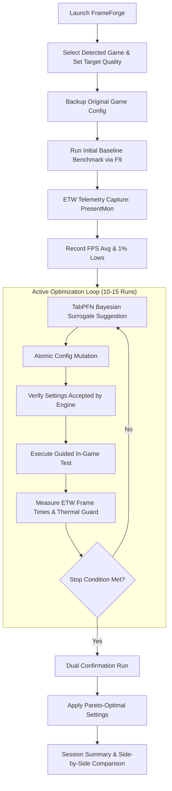

<p align="center">
  <h1 align="center">FrameForge</h1>
  <p align="center"><strong>Adaptive Game Graphics Optimizer · 100% Local & Offline</strong></p>
  <p align="center">
    <em>Stop guessing graphics settings. Measure them.</em>
  </p>
  <p align="center">
    <a href="https://github.com/devanshindepth/frame-forge/releases/tag/v1.0.0"></a>
    <a href="LICENSE"></a>
    <a href="https://www.rust-lang.org"></a>
    <a href="https://github.com/automl/TabPFN"></a>
    <a href="https://github.com/GameTechDev/PresentMon"></a>
    
    
    
  </p>
</p>

---

## 📖 Table of Contents

- [Overview](#-overview)
- [Why FrameForge?](#-why-frameforge)
- [Key Features](#-key-features)
- [How It Works](#-how-it-works)
- [Architecture & Tech Stack](#-architecture--tech-stack)
- [Downloads & Verification](#-downloads--verification)
- [System Requirements](#-system-requirements)
- [Supported Games](#-supported-games)
- [Extending FrameForge (Game Adapters)](#-extending-frameforge-game-adapters)
- [Research & Benchmarking Suite](#-research--benchmarking-suite)
- [Building from Source](#-building-from-source)
- [Project Layout](#-project-layout)
- [Security, Anti-Cheat, & Privacy](#-security-anti-cheat--privacy)
- [Contributing](#-contributing)
- [License & Acknowledgments](#-license--acknowledgments)

---

## 🎯 Overview

**FrameForge** is an open-source Windows desktop application that autonomously discovers the optimal graphics configuration for PC games on your unique hardware setup.

Rather than relying on blunt presets (*Low*, *Medium*, *High*, *Ultra*) or crude in-game auto-detect routines, FrameForge treats graphics optimization as a **constrained Bayesian optimization** problem. It directly benchmarks in-game performance using kernel-level **Event Tracing for Windows (ETW)** via Intel PresentMon, predicts the performance surface using an in-context **TabPFN neural surrogate model**, and identifies the configuration that maximizes throughput (average FPS) and frame pacing (1% lows) while strictly respecting your target visual quality threshold.

FrameForge operates **100% locally and offline**. It features zero cloud telemetry, performs no memory injection, and requires zero user account registration.

---

## 💡 Why FrameForge?

Modern PC titles expose dozens of visual toggles: shadow cascades, screen-space reflections, volumetric fog, global illumination, texture filtering, and upscaler modes. With an average of 10 to 14 settings offering 3 to 5 steps each, the configuration space explodes to **over 4,000,000 possible combinations ($4^{11}$)**.

1. **Presets are Inefficient**: High and Ultra presets often sacrifice 30–50% of your frame rate for visual effects virtually indistinguishable during gameplay (e.g., cinematic volumetric clouds or high-resolution subsurface scattering).
2. **Auto-Detect is Static**: Built-in auto-detect scripts rely on hardcoded GPU name tables, failing to account for CPU bottlenecks, thermal limits, display refresh rates, or memory bandwidth saturation.
3. **Manual Tweaking Wastes Hours**: Gamers spend entire evenings rebooting games, guessing settings, and squinting at synthetic benchmark graphs.
4. **Frame Pacing Matters**: High average frame rate means little if 1% lows drop into stutter territory. FrameForge optimizes for both average framerate and 1% low stability simultaneously.

FrameForge solves this with **sample-efficient active learning**: achieving near-oracle performance in just **10 to 15 targeted tests**.

---

## ✨ Key Features

### 🛡️ Non-Invasive Kernel Telemetry (Anti-Cheat Safe)
FrameForge captures frame-time telemetry via **Intel PresentMon** using native **Event Tracing for Windows (ETW)**. 
- **Zero code injection** into game memory
- **Zero DLL hooking** or overlay wrappers
- Safe with kernel and user-mode anti-cheat systems (**VAC, BattlEye, Easy Anti-Cheat, Vanguard**)

### 🧠 In-Context Bayesian Optimization (TabPFN v2)
Uses a frozen **TabPFN Prior-Data Fitted Network** engine as an active learning surrogate model:
- Requires **no gradient training or hyperparameter tuning** at runtime.
- Evaluates thousands of candidate points against an **Expected Improvement (EI)** acquisition function:
  $$\text{Objective} = \min(\text{FPS}_{\text{avg}}, \text{Hz}) + 0.5 \times \min(\text{FPS}_{1\%\text{-low}}, \text{Hz})$$
- Automatically stops once the probability of a meaningful performance gain ($> 1.5\%$) diminishes.
- Features an integrated **pure-Rust analytical fallback tuner** if the neural engine is unavailable.

### 🔒 Atomic Safety & Automatic Rollbacks
Your game's stability is paramount:
- **Instant Configuration Backup**: Existing configuration files are cloned to an isolated backup directory before modifying any setting.
- **Fail-Safe Restoration**: The original configuration is automatically restored if a session is cancelled, aborted, or if the process exits unexpectedly.
- **Applied Verification**: Reads back and verifies written config values to confirm the game engine did not discard them.

### 🌡️ Thermal & Telemetry Guard
Monitors hardware conditions in real time using local hardware telemetry (including NVIDIA NVML):
- Continuously monitors GPU core temperatures during benchmark loops.
- Automatically aborts testing if thermal thresholds are exceeded, preventing thermal throttling artifacts or hardware stress.

### 🎯 Dual Statistical Confirmation
Before declaring a final configuration winner, FrameForge conducts **dual confirmation runs** on both the baseline configuration and the optimal candidate. This eliminates false positives caused by background OS spikes, caching anomalies, or temporary disk I/O contention.

### 🌐 100% Air-Gapped & Private
Built from the ground up for strict local privacy:
- Python engine explicitly disables network calls (`HF_HUB_OFFLINE=1`, `socket.connect` blocked in-process).
- Zero cloud endpoints, zero tracking pixels, zero analytics.
- Runs entirely on your local machine.

---

## 🔄 How It Works



1. **Detect & Configure**: Select your installed game, target display refresh rate (e.g. 144 Hz), and desired visual fidelity floor (e.g. minimum 85% visual quality).
2. **Baseline Measurement**: FrameForge records your starting frame rate and 1% low baseline across a standardized in-game flythrough or test loop.
3. **Iterative Search**: The TabPFN engine proposes targeted graphics permutations. FrameForge mutates the game configuration file atomically, verifies the write, and measures frame times via ETW.
4. **Dual Confirmation**: Top settings are re-evaluated to ensure measured gains are statistically sound.
5. **Apply & Enjoy**: Confirm and lock in your new optimal settings, or revert to original with one click.

---

## 🛠️ Architecture & Tech Stack

| Component | Technology | Role |
|---|---|---|
| **Desktop Shell** | [Tauri v2](https://tauri.app/) (Rust) | Native window management, low-level OS operations, process supervision, hotkey listener (`F9`). |
| **User Interface** | HTML5 / Modern CSS / Vanilla ES6+ | Lightweight zero-runtime UI hosted inside native Windows WebView2. |
| **Telemetry Capture** | [Intel PresentMon](https://github.com/GameTechDev/PresentMon) (MIT) | Console x64 binary capturing kernel ETW frame-present events. |
| **Optimization Engine** | Python 3.11 + [TabPFN](https://github.com/automl/TabPFN) | Frozen PyInstaller sidecar communicating via stdin/stdout JSON lines protocol. |
| **Fallback Tuner** | Pure Rust (`engine.rs`) | Closed-form physical frame-time regressor ($1/\text{fps} = a + b \cdot \text{cost}$) ensuring 100% operational reliability. |
| **Configuration I/O** | Custom Rust Parsers (`configio.rs`) | Atomic read/write engine for INI, Valve KeyValues (`kv`), and JSON formats with rollback support. |
| **Game Adapters** | Declarative JSON Schemas | Metadata specifying game executables, configuration paths, options, and empirical cost/quality vectors. |

---

## 🚀 Downloads & Verification

Official production binaries for **FrameForge v1.0.0** are available on GitHub Releases:

| Package | Format | Architecture | Direct Download |
|---|---|---|---|
| **Windows Setup (Recommended)** | `.exe` (NSIS) | x86_64 | [FrameForge_1.0.0_x64-setup.exe](https://github.com/devanshindepth/frame-forge/releases/download/v1.0.0/FrameForge_1.0.0_x64-setup.exe) |
| **Windows Package** | `.msi` (WiX) | x86_64 | [FrameForge_1.0.0_x64_en-US.msi](https://github.com/devanshindepth/frame-forge/releases/download/v1.0.0/FrameForge_1.0.0_x64_en-US.msi) |

### 🔐 SHA-256 Integrity Verification

Validate file integrity prior to running the installer:

```powershell
# Verify FrameForge Setup Executable
Get-FileHash -Algorithm SHA256 .\FrameForge_1.0.0_x64-setup.exe

# Target Hash:
# 71eeb4839a038c444b22ffcf06aa1d669c150226c5bee78479818a4cf01cfb18

# Verify FrameForge MSI Installer
Get-FileHash -Algorithm SHA256 .\FrameForge_1.0.0_x64_en-US.msi

# Target Hash:
# 152695991ae4c052314779aff6bdd5625e5030416a0beee620acb3b34070930a
```

> [!NOTE]
> PresentMon relies on Event Tracing for Windows. Windows requires non-elevated users to belong to the built-in **"Performance Log Users"** security group to consume ETW kernel streams. The FrameForge installer automatically configures this group membership. A one-time PC restart may be required for Windows group policies to take effect.

---

## 💻 System Requirements

- **Operating System**: Windows 10 (Build 19041+) or Windows 11 (64-bit)
- **Processor**: 64-bit x86_64 CPU (Intel Core 4th Gen+ / AMD Ryzen or newer)
- **Graphics Card**: NVIDIA GeForce, AMD Radeon, or Intel Arc / Iris Xe graphics
- **Display Runtime**: Microsoft Edge WebView2 (pre-installed on Windows 10/11)
- **Privileges**: Windows "Performance Log Users" group (auto-configured by installer)

---

## 🎮 Supported Games

FrameForge includes official built-in adapters for popular titles, with community contributions expanding the catalog:

| Game | Adapter ID | Config Format | Benchmark Mode | Target Focus |
|---|---|---|---|---|
| **Counter-Strike 2** | `cs2` | Valve KeyValues (`kv`) | Guided Flythrough / Practice | CPU & GPU frame pacing, 1% lows |
| **Palworld** | `palworld` | Unreal INI (`ini`) | Guided Camera Sweep | VRAM usage, foliage, view distance |
| **Black Myth: Wukong** | `b1_benchmark` | Unreal INI (`ini`) | Automated Flythrough | Lumen, ray tracing, shadow scalability |

---

## 🔌 Extending FrameForge (Game Adapters)

Adding support for any PC title requires **zero code changes**—simply create a declarative JSON adapter in `app/src-tauri/resources/adapters/<game_id>.json`.

### Adapter Schema Example

```json
{
  "id": "my_game",
  "name": "My Custom Title",
  "short": "Open-world action RPG.",
  "steam_app_id": 1234560,
  "executables": ["MyGame-Win64-Shipping.exe", "MyGame.exe"],
  "config": {
    "format": "ini",
    "paths": [
      "{LOCALAPPDATA}\\MyGame\\Saved\\Config\\Windows\\GameUserSettings.ini"
    ]
  },
  "benchmark": {
    "mode": "guided",
    "warmup_s": 5,
    "where_to_test": "Load main hub, press F9, and pan camera across scene."
  },
  "settings": [
    {
      "key": "ScalabilityGroups/sg.ShadowQuality",
      "label": "Shadows",
      "help": "Resolution and cascade distance of dynamic shadows.",
      "options": [
        { "label": "Low", "value": "0" },
        { "label": "Medium", "value": "1" },
        { "label": "High", "value": "2" },
        { "label": "Ultra", "value": "3" }
      ],
      "cost": [0.00, 0.05, 0.11, 0.20],
      "quality": [2, 5, 8, 10]
    }
  ]
}
```

### Supported Path Variables
- `{LOCALAPPDATA}`: Resolves to `%LOCALAPPDATA%` (e.g., `C:\Users\<User>\AppData\Local`)
- `{APPDATA}`: Resolves to `%APPDATA%` (Roaming)
- `{DOCUMENTS}`: Resolves to `%USERPROFILE%\Documents`
- `{STEAM}`: Auto-detected Steam installation root
- `{STEAM_USER}`: Active Steam 32-bit account identifier
- `{INSTALL}`: Discovered game installation directory

### Supported Configuration Formats
- `ini`: Unreal Engine and standard Windows configuration files (`Section/Key` or `Key`).
- `kv`: Valve KeyValues quoted syntax (Source / Source 2 engine titles).
- `json`: Hierarchical JSON objects using dot notation (`graphics.shadows.quality`).

---

## 📊 Research & Benchmarking Suite

FrameForge includes a comprehensive optimization research harness located in `benchmark/stress_test.py`. It benchmarks TabPFN against 5 other surrogate optimization families across 10 empirical tests:

- **TabPFN v2**: In-context Prior-Data Fitted Network (zero-training surrogate)
- **GP (Matérn-5/2)**: Gaussian Process regression via BoTorch / scikit-learn
- **CatBoost**: Gradient boosted trees with Optuna hyperparameter optimization
- **XGBoost**: Gradient boosting with bootstrap Expected Improvement
- **SMAC (Random Forest)**: Multi-tree ensemble surrogate
- **MLP Ensemble**: 5-member multi-layer perceptron neural ensemble

### Test Matrix

```text
T1  Sample Efficiency        — Regression MAPE across small observation budgets (N=4, 8, 12, 16)
T2  End-to-End Regret        — Optimization regret (% of theoretical oracle) over iterations
T3  Uncertainty Calibration  — Empirical coverage of predicted 68% and 95% confidence intervals
T4  Noise Robustness         — Sensitivity to measurement noise (1% to 8% frame rate variance)
T5  Cold Start               — Leave-one-GPU-out transfer generalization
T6  1% Low Ranking           — Spearman rank correlation on frame-time variance predictions
T7  Missing Telemetry        — Robustness when sensor channels (e.g. VRAM) are unobserved
T9  Compute Latency          — Wall-clock recommendation latency per acquisition iteration
T10 Large-Scale Scaling      — Surrogate accuracy scaling up to 10,000 observations
```

### Running the Research Benchmark

```powershell
# Install benchmark dependencies
pip install tabpfn scikit-learn xgboost catboost optuna scipy numpy pandas

# Run quick verification smoke run
python benchmark/stress_test.py --quick

# Run full synthetic evaluation suite across 10 seeds
python benchmark/stress_test.py --seeds 10 --json benchmark/results-synthetic.json
```

---

## 🏗️ Building from Source

### Prerequisites

1. **Rust Toolchain**: Rust 1.77+ with Cargo ([Install Rust](https://rustup.rs/))
2. **Tauri CLI v2**:
   ```powershell
   cargo install tauri-cli --version "^2" --locked
   ```
3. **Python 3.11**: Required to bundle the PyInstaller sidecar engine.
4. **Intel PresentMon**: Place `PresentMon.exe` console binary into `app/src-tauri/resources/tools/`.
5. **WiX Toolset / NSIS**: Required for packaging `.msi` and `.exe` installers on Windows.

### 1. Build the Python Optimization Sidecar

```powershell
# Navigate to engine directory
cd app/engine

# Install build dependencies
pip install -r requirements.txt pyinstaller huggingface_hub

# Compile frozen engine executable
python build_engine.py
cd ../..
```

The compiled binary will be placed at `app/src-tauri/resources/engine/frameforge-engine.exe`.

### 2. Run in Development Mode

```powershell
cd app/src-tauri
cargo tauri dev
```

### 3. Build Production Installers

```powershell
cd app/src-tauri
cargo tauri build
```

Generated artifacts:
- NSIS Setup: `app/src-tauri/target/release/bundle/nsis/FrameForge_*_x64-setup.exe`
- WiX MSI: `app/src-tauri/target/release/bundle/msi/FrameForge_*_x64_en-US.msi`

---

## 📁 Project Layout

```text
frame-forge/
├── app/
│   ├── engine/                     # Python TabPFN optimization engine & sidecar builder
│   │   ├── build_engine.py         # PyInstaller freezing script
│   │   ├── frameforge_engine.py    # Stdin/stdout JSON IPC engine
│   │   └── requirements.txt        # Engine Python dependencies
│   ├── preview/                    # Static UI preview mocks
│   ├── src-tauri/                  # Tauri v2 core (Rust)
│   │   ├── resources/              # Bundled assets (PresentMon, engine, game adapters)
│   │   │   ├── adapters/           # JSON game adapters (CS2, Palworld, Wukong)
│   │   │   ├── engine/             # Frozen sidecar engine executable target
│   │   │   └── tools/              # Bundled Intel PresentMon binary
│   │   ├── src/                    # Rust backend modules
│   │   │   ├── adapters.rs         # Game discovery & adapter schema loading
│   │   │   ├── benchmark.rs        # PresentMon ETW execution & measurement parser
│   │   │   ├── configio.rs         # Atomic INI/KV/JSON config reader/writer
│   │   │   ├── engine.rs           # Sidecar process manager & Rust fallback tuner
│   │   │   ├── hardware.rs         # Sysinfo & NVML hardware telemetry
│   │   │   ├── session.rs          # Optimization state machine & rollback coordinator
│   │   │   └── lib.rs              # Tauri IPC commands & application lifecycle
│   │   ├── Cargo.toml              # Rust crate manifest & dependencies
│   │   └── tauri.conf.json         # Tauri v2 configuration & security capabilities
│   └── ui/                         # Desktop application frontend (HTML, CSS, JS)
├── benchmark/                      # Research harness comparing surrogate optimizers
│   ├── results-synthetic.json      # Benchmark results artifact
│   └── stress_test.py              # 10-test comparative evaluation suite
├── css/                            # Landing page styles
├── js/                             # Landing page scripts
├── index.html                      # Web portal & download landing page
├── LICENSE                         # MIT License
└── README.md                       # Project documentation
```

---

## 🔒 Security, Anti-Cheat, & Privacy

### Will FrameForge trigger anti-cheat bans?
**No.** FrameForge operates strictly through:
1. **Event Tracing for Windows (ETW)**: A standard Windows diagnostic subsystem provided by Microsoft. Intel PresentMon passively monitors frame swap and display queue events from the kernel. No memory addresses are read or written, no game code is patched, and no libraries are injected into the game process.
2. **Standard File I/O**: FrameForge writes to user settings files (e.g., `GameUserSettings.ini`, `cs2_video.txt`) on disk while the game is running or between sessions, identical to editing settings via Notepad or the game's options menu.

### Why does it need "Performance Log Users" permissions?
ETW session management requires non-administrator accounts to belong to the built-in Windows **Performance Log Users** security group. This prevents the application from needing continuous Administrator (UAC) elevation during everyday usage.

### Is my hardware or gameplay data collected?
**No.** FrameForge is strictly air-gapped:
- Network sockets are disabled at the runtime layer in the optimization engine.
- No user accounts, tokens, telemetry endpoints, or cloud connections exist in the codebase.
- Everything stays on your local machine.

---

## 🤝 Contributing

Contributions are welcome from game optimization enthusiasts, developers, and researchers!

- **Add New Game Adapters**: Submit a PR adding a JSON file in `app/src-tauri/resources/adapters/`.
- **Improve Optimizers**: Contribute improvements to `app/engine/frameforge_engine.py` or the Rust fallback tuner in `app/src-tauri/src/engine.rs`.
- **Report Bugs**: Open an issue describing your hardware specs, game title, and observed behavior.

---

## 📜 License & Acknowledgments

- **FrameForge**: Distributed under the [MIT License](LICENSE). Copyright © 2026 Devansh.
- **Intel PresentMon**: Bundled under the [Intel GameTechDev MIT License](https://github.com/GameTechDev/PresentMon).
- **TabPFN**: Research and architecture developed by the AutoML group at the University of Freiburg and Prior Labs.
- **Tauri**: Built with the [Tauri Framework](https://tauri.app/) under MIT / Apache 2.0.
